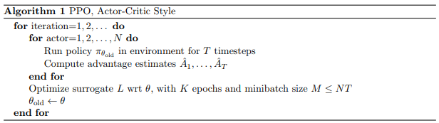
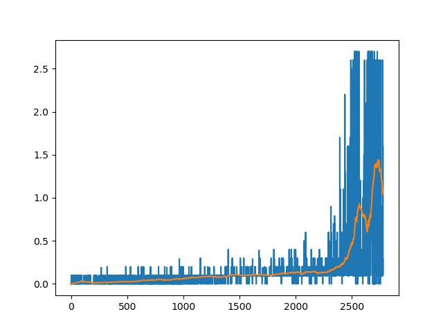

# Udacity Deep Reinforcement Learning - Continuous Control (Project 2)
## Report

In this project, the goal is to teach an agent to play table tennis.
Two agents control rackets to bounce a ball over 
a net. If an agent hits the ball over the net, it receives a reward 
of +0.1.  If an agent lets a ball hit the ground or hits the ball 
out of bounds, it receives a reward of -0.01.  Thus, the goal of 
each agent is to keep the ball in play.

The observation space consists of 8 variables 
corresponding to the position and velocity of the ball and 
racket. Each agent receives its own, local observation.  Two 
continuous actions are available, corresponding to movement toward 
(or away from) the net, and jumping. 

The environment is considered solved, when the average (over 100 episodes)
 of those **scores** is at least +0.5.

---
## Algorithms
For this project I've implemented PPO.


### PPO
PPO algorithm is summarised below:


The Proximal Policy Optimisation method is a good alternative to DDPG for this problem.
It also shows much better results in continuous control tasks according to [benchmarks](https://arxiv.org/pdf/1604.06778.pdf).

**Idea (Summary)**

- Critic. Use neural network for value function approximation: `state` -> `value(state)`
- Actor. Use neural network for policy approximation, 
that represents value function: `state` -> `action`. 
However, the network outputs mean and standard deviation of the 
action, that is sampled from the Gaussian distribution afterwards. 
This enables exploration at the early stages of the agent training. 

**Notes and Discussion**

This version of PPO contains minor changes from the version used in project 2. Given the episodic nature of the task, I 
adapted code to rollout multiple trajectories until fixed number of timesteps in total. 
This just simply allows us to gather enough data for training. This minor change allows to successfully solve the environment. 

I also made some attempts to implement MADDPG and adapt the concept of multiple agents to PPO, so that a critic net observe full state (e.g. observations of both agents).
Unfortunately, MADDPG doesn't stably converge and MAPPO shows much slower convergence and overall worse performance then PPO. As a result I didn't include training results for these algorithms. In the future I plan to fix them properly.

## Results:

### PPO


It can be seen that in both cases the environment was solved in less than 150 episodes.

To play a trained agent, run the following
> ```console
> (drlnd) $ python3 ./play.py [path to a trained agent file]
> ```
Trained agents could be found in the `models` folder.

## Future Work

As been said in *Notes and Discussion*, MADDPG and MAPPO implementation need to be fixed.
So far, I have following concerns about them:
- Should critic have one output layer for all agents or one output layer for an each agent?
- Should we have multiple independent agents or just one?
 For the game like table tennis (when behaviour of both agents should if not than almost the same) it seems that having multiple agents doesn't bring 
 any benefits. Rather than that, it's just getting harder to train multiple agents simultaneously.
 
